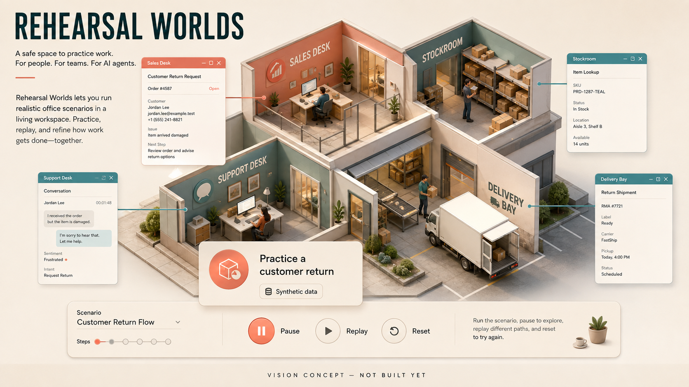

# Rehearsal Worlds

**An open practice world where AI agents can learn and fail before touching a real business.**

Before an AI agent runs your business workflow, let it prove itself in a business you can reset.

> This is a public planning repository. There is no product implementation or playable build yet. The image is an AI-generated vision reference, not a screenshot. All waves and tasks are proposed; no completed work, community approval or funding is implied.

## The mission

Build reproducible, editable simulations of organizational work: customers, documents, stock, permissions and consequences. Teams should be able to rehearse agents against realistic failures using synthetic data and inspect the outcome, not just a fluent answer.

Choose a company scenario, configure roles and constraints, run an agent, inspect the resulting application state, replay the mistakes and reset the world. Change a policy or application behavior and see whether the workflow still works.

## Who this is for

Teams evaluating business agents, researchers, and developers who need repeatable end-to-end workflow tests.

## The first thing we want to prove

One synthetic customer-return workflow across support, inventory and order records, with a complete baseline, a reset button and deliberate failure cases.

Agents can learn the benchmark instead of the work. Use hidden scenario variations, independent outcome checks and explicit limits on how simulated performance transfers to real systems.

## What this could become

A shared ecosystem of company-world modules and scenario packs, including private organizational worlds and public reproducible evaluations.

Browser and computer-agent benchmarks already exist. The proposed contribution is an approachable, extensible organizational rehearsal product: editable business rules, persistent multi-app consequences and continuous testing in worlds teams can own.

## Why build it together

Operations experts can author realistic edge cases; developers can build app modules; researchers can improve outcome scoring. Synthetic worlds let people share difficult workflows without publishing customer records.

We are looking for founding maintainers and contributors who can make one small, reviewable part real. Bring a concrete use case, a difficult test case, an interface sketch or a focused patch. If you use a coding agent, give it one agreed task and review its result. Accepted work matters more than generated volume.

## How to join

Start with [the project on Tanduna](https://tanduna.com/projects/rehearsal-worlds). Read the [six-wave roadmap](ROADMAP.md) and [twelve proposed tasks](TASKS.md), then join the planning discussion and say which result you can help deliver. Propose scope before starting overlapping implementation. GitHub holds the source; Tanduna is where we organize the project and its community.

- **W1: One company you can reset.** Specify a complete business scenario and its ground truth.
- **W2: A working rehearsal environment.** Build the reference world and observation surface.
- **W3: Score the work, not the performance.** Make success and failure independently checkable.
- **W4: Teams can author their own worlds.** Turn the fixture into an extensible product.
- **W5: Comparable across agents and versions.** Make evaluations reproducible without encouraging benchmark gaming.
- **W6: A maintained laboratory of work.** Prove practical value and keep worlds current.

## What we are not promising

No claim that passing a simulation makes production deployment safe. No importing private production data by default, fake benchmark superiority or model training rights over contributed private scenarios.

There is no delivery date, token target, paid offer or crowdfunding campaign here. Community interest does not guarantee a finished product. The next milestone depends on contributors, maintainer capacity and evidence from the previous one.

## Existing work we should learn from

- [BrowserGym](https://github.com/ServiceNow/BrowserGym)
- [OSWorld](https://osworld-v1.xlang.ai/)

These are related foundations and references, not partners or endorsements. We should reuse compatible components or contribute upstream when that is the better route. This proposal does not claim that its individual ingredients are unprecedented. Dependencies and their licenses will be evaluated before adoption.

## License and contribution

This repository is published under [GNU AGPL-3.0](LICENSE). See [CONTRIBUTING.md](CONTRIBUTING.md) for the proposed contribution workflow and [the image note](assets/README.md) for concept provenance.
